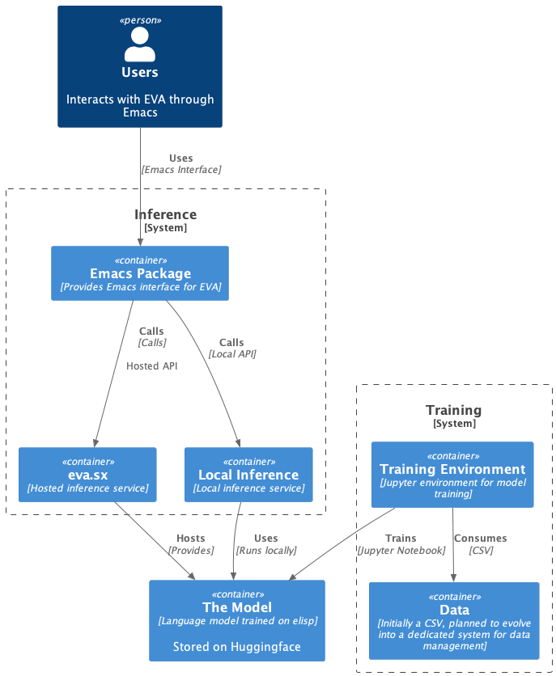

# EVA - Emacs Virtual Assistant

EVA is the first AI trained to work along side you, in Emacs.
The goal is to have her take on more and more of the actual manipulation of Emacs and its buffer content, while the human provides instructions and feedback. 
This is to be achieved through a combination of a general-purpose language model and several specialized agents (coding, reasoning, memory, or [contribute](https://github.com/LazerJesus/EVA#contribution) your own); all trained on elisp, which is piped directly into the REPL.
The project is under active development and has not yet launched. There is a proof of concept system in place, but it does not yet provide any value beyond being a proof of concept.

If you haven't yet, read the announcement [Article](https://finnfrotscher.com/posts/eva-emacs-virtual-assistant/).

My motivation for writing the article and this repository beyond gathering stars is (1) to convince you to contribute your valuable competence to this project and (2) to establish as a ground zero for a conversation about the model and application we are going to develop over the coming months and years. Hopefully.

<div style="clear: both;"></div>

| [Article](https://finnfrotscher.com/posts/eva-emacs-virtual-assistant/)
| [Huggingface](https://huggingface.co/lazerjesus/eva) 
| [Github](https://github.com/lazerjesus/eva) 
| [Discord](https://discord.gg/9Uxn45ADJs)

## Roadmap
we have a few questions to answer before we can start building.
on a high level those are (1) what do we launch first (2) how do we get data and (3) what do we build next.
I have some ideas but I would love to hear yours. My ideas are summarized in challanges and strategy below. Please join the [Discord](https://discord.gg/9Uxn45ADJs) to discuss and contribute.

## Challanges
We are constrained in multiple dimensions and I see a few ways this project could go sideways. Those are data, ambition and timing. 

### Data
LLMs require large amounts of specific, high quality data and no such dataset exists for Emacs. We need data to train EVA to use Emacs. 

### Ambition
Getting lost in an overly large vision and not providing value immediately.

### Timing
Timing, or Performance. We are still very early in the development of LLMs, GPUs and the performance might just not be there yet. Maybe the model can't run on a local machines fast enough to provide a sane user with value. Maybe the model needs to be too large to be able to run locally. 

## Strategy
To solve these challanges I think we should focus on providing a small amount of value immediately and design the system in a way that allows us to add incremental value as the technology matures. Concretely this means that I think we should build and deploy a simple autocomplete system now. Probably based on Llama2. The value would be (1) that we start to build a community around the project. (2) That we provide immidiate value to users. (2) That we learn to run and deploy such a system in production. Then, in parallel, build out tools and methods for data aquisition and design custom models for specific, well defined tasks.

I see two ways to get data. (1) We can generate it manually. Or (2) Users donate it. My sense is that it will be a combination of both. We provide a way for users to donate data, which is used to train the foundation model. And we maintain a high quality dataset by hand for finetuning the specific tasks and skills EVA should master.


##  Architecture
Users interact with EVA through an Emacs package, which can communicate with either a locally hosted inference service or a hosted API at eva.sx. The core language model is trained in a separate environment and consumes the training data from a CSV. In the future, data should be generated and managed by a dedicated system.



### Containers
Users: End-users interacting with EVA via Emacs.
Emacs Package: Client-side package providing the interface for EVA.
eva.sx: Centralized service hosting the inference API.
Local Inference: Handles inference tasks for local setups.
EVA: Core language model for code completion and Emacs functionalities.
Training Environment: Separate setup for model training.
Data: Initial CSV file for training, planned to evolve into a dedicated system.


## Data
AI is very hungry for data. codellama was trained on 500.000.000.000 tokens. That's a lot of data. The 18k lines trainingset I used for the proof-of-concept is 740.722 tokens. 499.999.259.278 to go. We need to find a way to get data for EVA. Lets start with the types of data. For training EVA, we essentially need two types of datasets: 

### Foundational Data
This is a massive amount of data that might be generated by recording regular Emacs usage sessions, which would provide a broad base of interactions to train the foundational model. With this, EVA can learn how Emacs users behaves in a wide range of scenarios. 
  
### High-Quality Instructions
This smaller, curated data set will contain specific instructions and their corresponding Elisp outputs. It's has to be a carefully crafted set of interactions that helps fine-tune EVA's abilities and responses. This gives EVA the specific knowledge to perform certain tasks. 

Creating these specialized datasets allows EVA to adapt to Emacs users' unique needs and provide quick and refined responses. Most of the work in the initial stages will go into generating and curating these training datasets.

This method of progressively refining a foundational model with targeted data (transfer learning) will enable EVA to respond efficiently to both common and unique Emacs operations and requests.

### Currently
Here's a sample from the current dataset that I used to finetune codellama:
```csv
'''How do I generate the Fibonacci sequence up to a specific number?''';'''(defun fibonacci-sequence (n) (if (< n 2) (list 0) (let ((result (list 0 1))) (while (< (car (last result)) n) (setq result (append result (list (+ (car (last result)) (cadr (last result))))))) (car (last result)))))'''
'''Check if a given string is a palindrome''';'''(let ((string (read-string "Enter a string: "))) (if (equal string (apply #''string (reverse (string-to-list string)))) "Palindrome" "Not a Palindrome"))'''
'''How can I know if the Emacs server is currently active?''';'''(equal (process-status server-process) (intern "run"))'''
'''Run a Python script''';'''(shell-command (concat "python " (read-file-name "Enter the name of the Python script: ")))'''
```
As you can see, the data is a simple CSV file with two columns: the instruction and the corresponding Elisp code. Most of the data was AI generated. Currently its not useful boyond proof of concept.

## Contribution
Contributing to EVA can take several forms and be aligned with different phases of the project. I am seeking help with data, development of the Elisp client, design and provisioning of the model, as well as insightful discussions and feedback.

### Data Contribution 
A vital part of training AI, including EVA, is data. You can help me by providing examples of tasks and corresponding Elisp code, adapting existing datasets to Elisp, and capturing and annotating Elisp during daily Emacs usage. If you're up for a challenge, consider building a data contribution system to streamline this process.

### Elisp Client Development 
A robust Emacs package is critical for smooth interaction between EVA and Emacs. If you're experienced or interested in creating such packages, your contribution would be of immense value here.

### Model Development 
The choice and design of our model architecture plays a key role in the success of EVA. Participating in discussions and experiments around potential model architectures would be a significant contribution at this stage.

## Miletstones
From my current vanatage point, I see the project evolving in three steps. 

### Alpha - Proof of Concept
We are here. The idea is articulated and a demonstration of the concept is available. Now we need to build a community around the project and decide what to do next.
If the community agrees, we will build a hosted autocomplete service based on codellama and a system for data aquisition and curation. 

### Beta - Working Autocomplete Service
The beta phase centers around refining a working autocomplete service to offer immediate, but limited, functionality to users.

### Version 1.0 - A Fully Working System
Upon reaching version 1.0, our aim out to be to have a first stab at a comprehensive system in place. What this will look like is up to the community to ideate and commit to.

Regardless of the phase, your participation in conversations, contributions to the ongoing development, and usage of EVA are immensely valuable. Thank you for being a crucial part of the EVA project and helping enhance the capabilities of Emacs.

## Model Card
### Model Details
The current model is fine-tuned on top of a 3b foundation model with a 300m Lora adapter.

### Training Data
The model was trained on 18,000 rows of instruction + Elisp pairs, covering topics from math to file administration. Most of the data was AI-generated.


## Contact
Feel free to join the [Discord](https://discord.gg/9Uxn45ADJs) or create a GitHub issue.

## Installation and Running Instructions
[... Following]

## Demo of Current Capabilities
[... Following]


